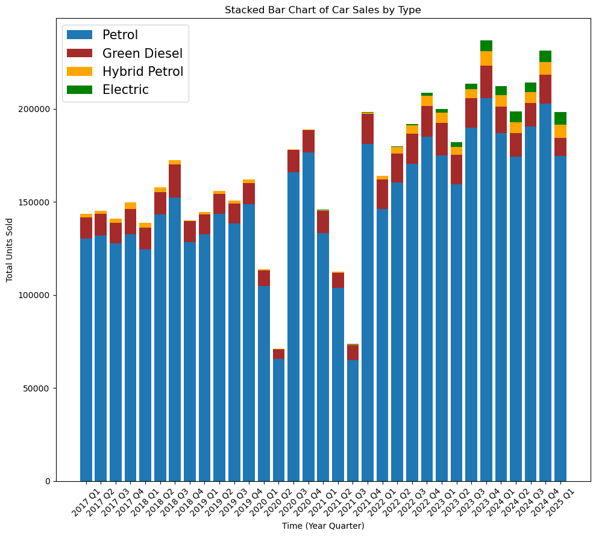

# Key Factors Affecting Oil Prices and the Market Share of ICE, HEV, and EV in Malaysia

# 马来西亚油价及燃油车、混合动力车和电动汽车市场份额影响因素研究

## Project Description / 项目描述

This repository presents a research project focused on analyzing the key factors influencing oil prices and their subsequent impact on the market share dynamics of Internal Combustion Engine (ICE) vehicles, Hybrid Electric Vehicles (HEV), and Electric Vehicles (EV) in Malaysia. The study aims to provide insights into the evolving automotive market landscape in the region, considering policy-related variables.

本项目展示了一项研究项目，旨在分析影响油价的关键因素及其对马来西亚燃油车（ICE）、混合动力车（HEV）和电动汽车（EV）市场份额动态的影响。本研究旨在通过考虑政策相关变量，深入了解该地区不断发展的汽车市场格局。

## Research Objectives / 研究目标

* To identify the primary factors driving fluctuations in oil prices and the market share of different vehicle types (ICE, HEV, EV).

* To investigate the relationship between oil prices and the market share of different vehicle types in Malaysia.

* To contribute to a better understanding of the Malaysian automotive market's transition towards sustainable mobility.

* 识别影响油价以及不同类型车辆（燃油车、混合动力车、电动汽车）市场份额波动的主要因素。

* 研究油价与马来西亚不同类型车辆市场份额之间的关系。

* 为更好地理解马来西亚汽车市场向可持续出行转型做出贡献。

## Methodology / 研究方法

The research employs a comprehensive methodology, including:

* **Chapter 4, Data Collection:** Gathering relevant time-series data on oil prices and vehicle registration specific to Malaysia.

* **Chapter 5, Data Preprocessing and Cleaning:** Ensuring data quality, handling missing values, and preparing datasets for analysis.

* **Chapter 6, Exploratory Data Analysis (EDA) and Visualization:** Gaining initial insights into data patterns and relationships through statistical summaries and graphical representations. This phase involves:
  * Visualize the trend of registration and market share of various energy vehicles over time using line charts, stacked line charts, and stacked bar charts.
  * Visualize the change of oil prices in Malaysia over time using grouped bar charts and heat maps.
  * Use price elasticity analysis to make a preliminary analysis of the relationship between oil prices and the market share of each vehicle.
  * Use scatter plots to explore the impact of oil prices on consumer preferences.
  * Find important turning points in the data and analyze the reasons.

* **Chapter 7, Statistical Modeling:** Utilizing advanced statistical techniques such as Multivariate Time Series Analysis (e.g., VARX, VECM) and various Regression Models to identify significant correlations and predictive relationships.

本研究采用全面严谨的方法，包括：

* **第四章，数据收集**：收集与马来西亚相关的油价、车辆注册等相关时间序列数据。
* **第五章，数据预处理与清洗**：确保数据质量，处理缺失值，并为分析准备数据集。
* **第六章，探索性数据分析（EDA）与可视化**：通过统计摘要和图表表示，初步了解数据模式和关系。此阶段包括：
  * 利用折线图、堆积折线图以及堆积条形图、可视化各种能源车辆注册、市场份额随时间变化的趋势。
  * 利用分组条形图、热图可视化马来西亚油价随时间的变化。
  * 使用价格弹性分析对油价和每款车型的市场份额关系做初步分析。
  * 使用散点图探索油价对消费者偏好的影响。
  * 找到数据重要转折点并分析原因。
* **第七章，统计建模**：利用多元时间序列分析（例如：VARX、VECM）和各种回归模型等先进统计技术，识别显著相关性和预测关系。

## Visualization / 可视化展示

## Keywords / 关键词

Oil Prices, Electric Vehicles (EV), Hybrid Electric Vehicles (HEV), Internal Combustion Engine (ICE), Market Share, Malaysia, Time Series Analysis, Regression Models, Automotive Industry

油价、电动汽车 (EV)、混合动力电动汽车 (HEV)、内燃机车 (ICE)、市场份额、马来西亚、时间序列分析、回归模型、汽车行业

## Authors / 作者

* 崔泽禹，Cui Zeyu: [https://github.com/zeyu10](https://github.com/zeyu10)

* 尉芳瑞，Yu Fangrui: [https://github.com/Selene277](https://github.com/Selene277)

## Full Report / 完整报告

[Report-EN](Report-EN.pdf)
